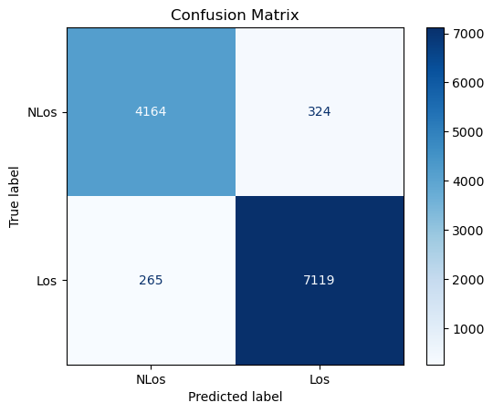
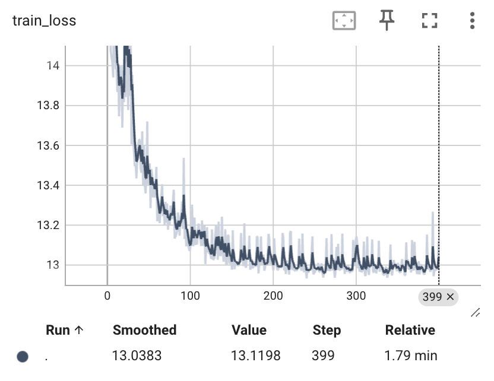
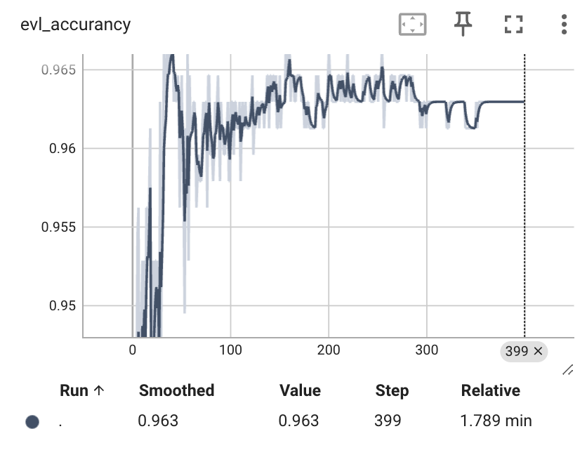
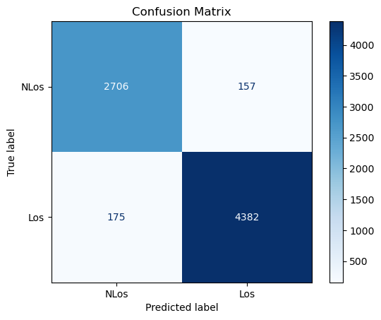
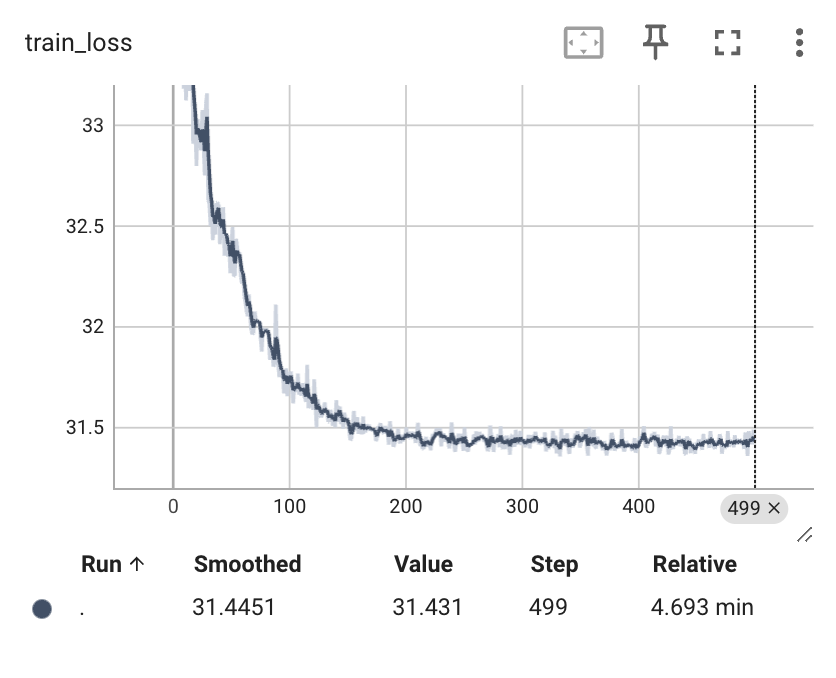
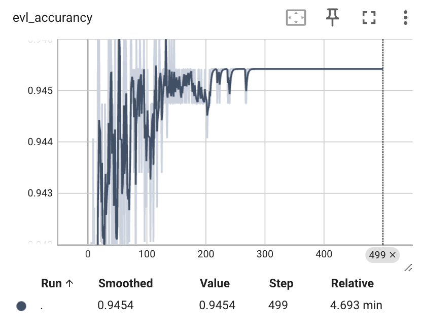

# Large Wireless Model (LWM): A Foundation Model for Wireless Channels
```
@misc{alikhani2024largewirelessmodellwm,
      title={Large Wireless Model (LWM): A Foundation Model for Wireless Channels}, 
      author={Sadjad Alikhani and Gouranga Charan and Ahmed Alkhateeb},
      year={2024},
      eprint={2411.08872},
      archivePrefix={arXiv},
      primaryClass={cs.IT},
      url={https://arxiv.org/abs/2411.08872}, 
}
```
## 对Los/NLos进行分类任务
使用LWM模型对信道进行预训练，将得到的CLS嵌入用于下游任务。
这里的下游模型用的是全连接前馈神经网络

本实验主要是复现LWM模型对Los/NLos进行分类任务

### 使用CLS嵌入
由于LWM模型对信道进行预训练，学习了上下文的密切关系，在下游模型中，只需要对少量的数据集进行训练就有了比较客观的泛化能力
#### 1.训练集 20%
Test Accuracy:0.9504
Confusion Matrix

train_loss

evl_accurancy



#### 2.训练集 50%

Test Accuracy: 0.9553
Confusion Matrix

train_loss

evl_accurancy



## 结果
20%的测试集准确率已经有比较高的泛化能力